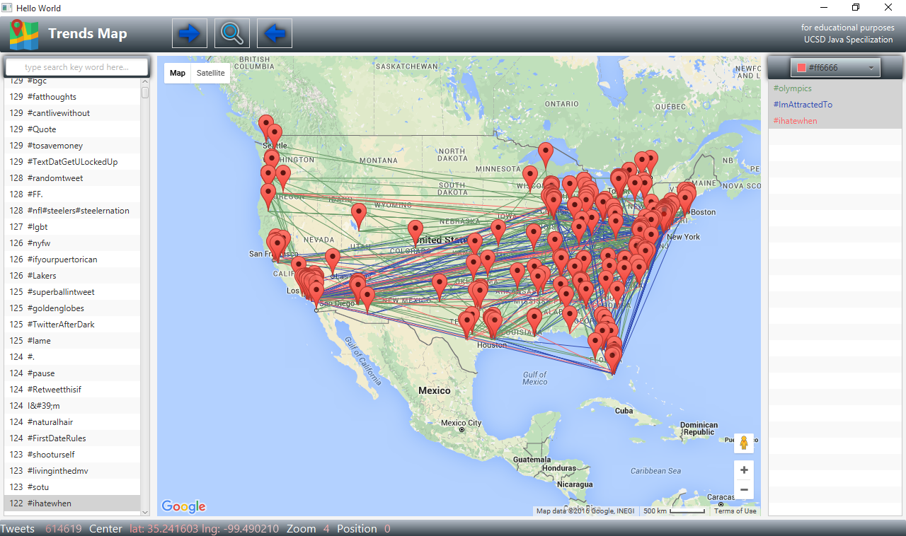

# TrendsMap
View Twitter #Hash_Tags using google Maps and JavaFX.  

External libraries : [Joda-Time](http://www.joda.org/joda-time/) & [GMapsFX](http://rterp.github.io/GMapsFX/)

Data Set : [TwitterData](https://archive.org/details/twitter_cikm_2010)

you can change Data Set path in [Main.java](/src/com/cookiescode/trendsmap/Main.java)

      data set format :
      
      user_id tweet_id hash_tags date time latitude,longitude 
      
      e.g : 12123455 83743434 #hello #yo 2016-04-06 14:30:34 43.2312123,-113.123213

